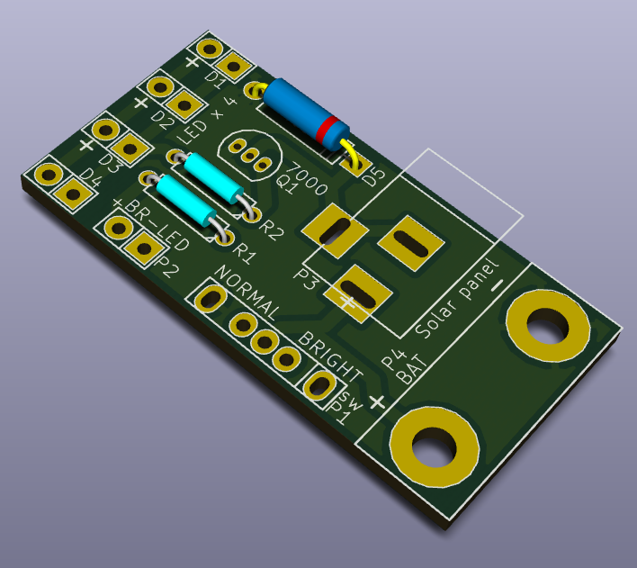
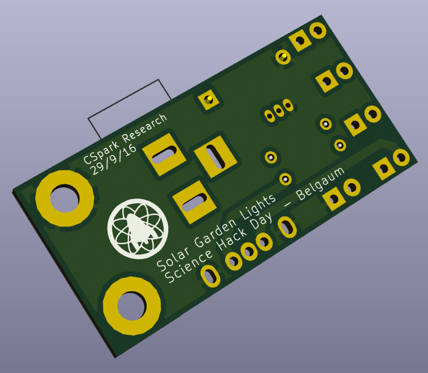

# solar-lanterns
Design files for automatic solar garden lanterns used at Science Hack Day, Belgaum 2016

Top Side Screenshot |  Bottom Side Screenshot
 --------------------------- | ---------------------------------
    |  

This board was designed by [CSpark Research](https://github.com/csparkresearch) for Science Hack Day, Belgaum , 2016.

It consists of the following elementary components
+ Barrel Jack for plugging in the solar panel
+ 6V/1W solar panel
+ Custom mounting holes for rechargeable 4V/400mAh lead acid battery
+ 2N7000 MOSFET to turn on the LEDs only if the battery is not being charged (no sunlight present)
+ 2x current limiting resistors
+ 4x LEDs (5mm white)
+ 1x RGB LED/any other alternate light source
+ 1x Slider switch to select between the 4x LEDs or the alternate LED light

It is intended as a tool to enhance soldering skills, as well to create a usable garden lamp that charges by day, and lights up by night

Happy Hacking! :)

## Dependencies
+ [KiCad EDA](http://kicad-pcb.org/)

Rendered Gerber files are present in the `Gerber` directory

[License](./LICENSE.txt): GPLv3
